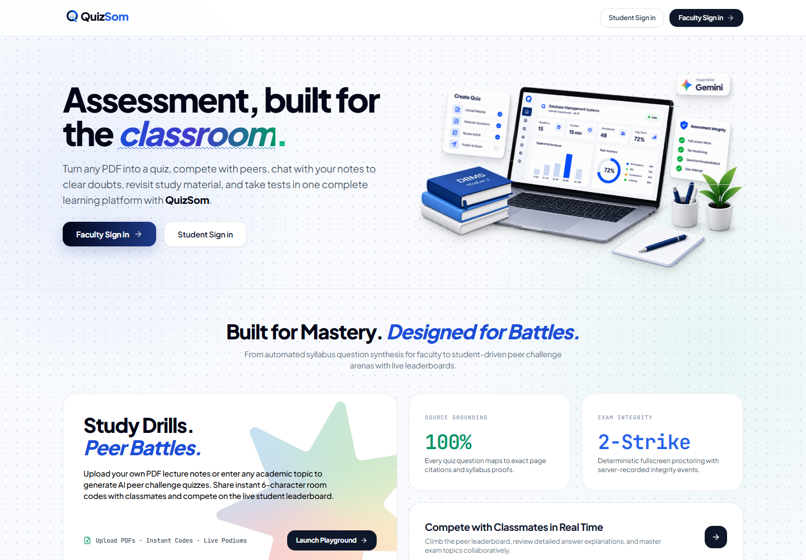
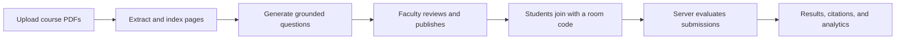
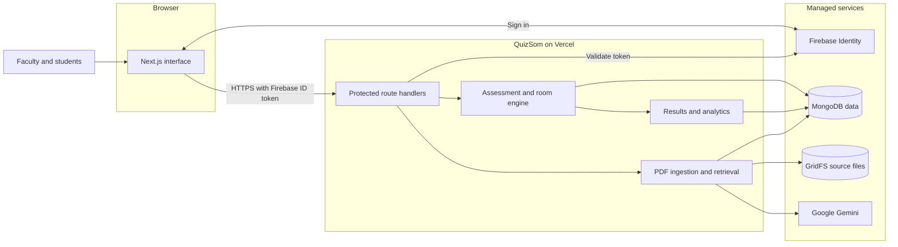

# QuizSom

### One end-to-end platform to study, practise, compete, and take tests.

[](https://quizsom.vercel.app)
[](https://nextjs.org/)
[](https://ai.google.dev/)

Turn any PDF into a quiz, compete with peers, chat with your notes to clear doubts, revisit study material, and take tests in one complete learning platform with **QuizSom**.

Built for colleges and universities, QuizSom gives faculty a reviewable assessment workflow and gives students one connected place for source-grounded study, peer practice, formal tests, and cited feedback.

**[Try QuizSom →](https://quizsom.vercel.app)**



## Why QuizSom

Creating a useful internal assessment usually means reading long PDFs, writing questions by hand, organizing an exam, watching for integrity issues, grading submissions, and explaining the results. QuizSom brings that workflow into one product:

- **Grounded generation:** questions are generated from uploaded course material and retain page level source citations.
- **Faculty review:** generated questions can be reviewed, edited, or regenerated before publishing.
- **Controlled delivery:** room codes, server based timing, randomized questions and options, and a two strike fullscreen policy support live assessments.
- **Useful feedback:** students receive answer explanations and source context while faculty receive score, question accuracy, topic, and integrity analytics.
- **Student practice:** students can ask questions from assigned notes or create peer challenges from PDFs and academic topics.

## Product workflow



### For faculty

1. Upload syllabus, lecture notes, or reference PDFs.
2. Select one or more materials and configure an assessment.
3. Review AI generated questions and their source grounding.
4. Publish a room and share its six character code.
5. Monitor participation, completion, and integrity events.
6. Review class analytics and question level performance.

### For students

1. Join an assessment with a room code.
2. Complete the timed quiz in the controlled exam interface.
3. Review results, explanations, and the cited PDF page.
4. Study assigned materials through grounded chat.
5. Create peer quizzes and compete on live leaderboards.

## Core capabilities

| Area | Capability |
| --- | --- |
| Course material | PDF ingestion, page aware chunking, text sparse OCR fallback, and semantic retrieval |
| Assessment creation | Multi material generation, faculty review, editing, and targeted regeneration |
| Source grounding | Page citations, excerpts, and authenticated access to the original PDF |
| Exam delivery | Six character rooms, server timestamps, randomized ordering, and attempt locking |
| Integrity | Fullscreen monitoring, two strike submission policy, and integrity event logs |
| Analytics | Score distribution, question accuracy, topic mastery, and deterministic rankings |
| Student learning | Assigned materials, grounded study chat, result review, and peer quiz battles |

## Architecture

For the complete large-document RAG architecture, sequential ingestion design, storage layout, retry model, and retrieval flow, read [RAG System Design](docs/RAG_SYSTEM_DESIGN.md).



| Layer | Responsibility |
| --- | --- |
| Browser | Renders the faculty and student interfaces and sends authenticated API requests |
| Identity | Firebase signs users in; protected requests carry an ID token that the server validates |
| Application server | Next.js route handlers enforce access, own exam timing, evaluate submissions, and coordinate rooms |
| Retrieval pipeline | Extracts PDF text, runs OCR when needed, creates page aware chunks, retrieves context, and asks Gemini to generate grounded content |
| Persistence | MongoDB stores users, assessments, rooms, attempts, citations, and analytics; GridFS stores original source files |

### Main data flows

1. **Material ingestion:** faculty upload a PDF → the server stores the original in GridFS → text is extracted or recovered through OCR → page aware chunks and retrieval metadata are stored in MongoDB.
2. **Assessment generation:** faculty choose materials → relevant chunks are retrieved → Gemini generates questions with citations → faculty review the draft → the server publishes the assessment and room.
3. **Exam delivery:** students join with a code → the server creates an attempt and authoritative deadline → answers and integrity events are recorded → the server scores the final submission.
4. **Review and analytics:** attempt data becomes student feedback, cited source previews, class distributions, question accuracy, topic mastery, and leaderboards.

## Run locally

### 1. Clone and install

```bash
git clone https://github.com/shreejaykurhade/QuizSom_Devengers.git
cd QuizSom_Devengers
npm install
```

### 2. Configure the environment

Create `.env.local` in the project root:

```env
GEMINI_API_KEY=

MONGODB_URI=
MONGODB_DB=quizsom

NEXT_PUBLIC_FIREBASE_API_KEY=
NEXT_PUBLIC_FIREBASE_AUTH_DOMAIN=
NEXT_PUBLIC_FIREBASE_PROJECT_ID=
NEXT_PUBLIC_FIREBASE_STORAGE_BUCKET=
NEXT_PUBLIC_FIREBASE_MESSAGING_SENDER_ID=
NEXT_PUBLIC_FIREBASE_APP_ID=
NEXT_PUBLIC_FIREBASE_MEASUREMENT_ID=
```

Enable the sign in providers used by the application in the matching Firebase project.

### 3. Start the app

```bash
npm run dev
```

Open [http://localhost:3000](http://localhost:3000).

## Useful routes

| Route | Purpose |
| --- | --- |
| `/` | Product landing page |
| `/teacher/dashboard` | Faculty assessment overview |
| `/teacher/materials` | Course material management |
| `/teacher/create` | Assessment creation workflow |
| `/teacher/rooms` | Live and historical exam rooms |
| `/teacher/results` | Faculty results and analytics |
| `/student` | Student dashboard |
| `/student/materials` | Assigned course PDFs |
| `/student/chat` | Grounded study assistant |
| `/student/playground` | Peer quiz challenges |

## Production checks

```bash
npx tsc --noEmit
npm run build
```

## Product status

QuizSom is under active development as a college assessment product. The live deployment demonstrates the complete faculty and student workflow, including course material ingestion, assessment generation, room based delivery, result review, and peer learning.
