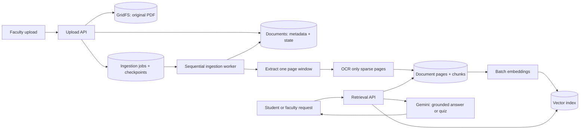
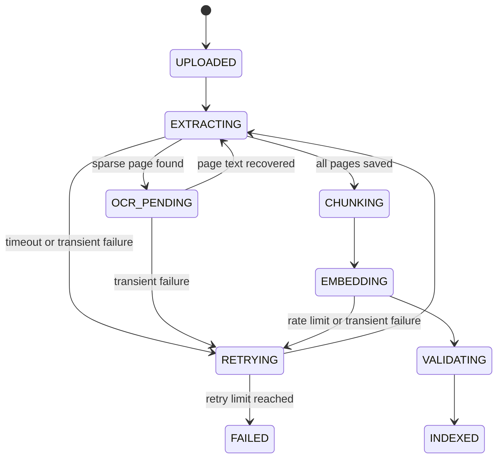

# QuizSom RAG System Design

## Goal

QuizSom must process a 400-page course PDF without holding the full ingestion flow inside one web request. The same indexed material must serve study chat, quiz generation, answer explanations, and exact page previews without processing or embedding the PDF again.

## Architecture



## Storage model

| Store | What it contains | Why it is separate |
| --- | --- | --- |
| GridFS `materialFiles` | The untouched upload, once per document | Keeps the original file durable and supports exact page viewing. |
| `documents` | Owner, course, file metadata, hash, status, page count, and index version | Keeps the main document record small and fast to read. |
| `ingestionJobs` | Stage, page cursor, chunk cursor, retry count, error, and heartbeat | Makes a failed 400-page upload resumable instead of starting over. |
| `documentPages` | Extracted text and OCR result for one page | Preserves page boundaries for honest citations and selective reprocessing. |
| `documentChunks` | Chunk text, page number, section, token count, checksum, and vector reference | Supports keyword fallback and citation lookup without returning the whole PDF. |
| Vector index | One embedding per chunk with `documentId`, `courseId`, `ownerId`, and `pageNumber` filters | Keeps vectors outside the main Mongo document, avoiding the 16 MB BSON limit. |

For MongoDB Atlas, `documentChunks` can hold the embedding and use an Atlas Vector Search index. For a larger deployment, the same chunk metadata can remain in MongoDB while vectors move to a dedicated vector database. The application interface does not change.

## Sequential ingestion workflow

1. **Accept and register** — authenticate the uploader, calculate a SHA-256 file hash, store the original once in GridFS, create a `documents` record with status `UPLOADED`, and enqueue an `ingestionJobs` record.
2. **Inspect** — a worker reads file metadata and page count, then changes the document to `PROCESSING`. The upload endpoint returns immediately with the document ID and progress state.
3. **Extract in windows** — the worker handles a small page window at a time, such as 10 pages. After every window it writes the extracted page records and advances `pageCursor`.
4. **OCR only when needed** — a page with too little text is marked `OCR_PENDING` and sent through OCR. Text-based pages never consume OCR capacity.
5. **Create page-aware chunks** — each page is split into 250–400 token chunks with a small overlap only within that page. Chunks never cross page boundaries, so a citation always maps to one visible page.
6. **Embed in batches** — chunks are embedded in small ordered batches, such as 16–32 chunks with concurrency 2–4. Every successful batch is persisted before the next batch begins.
7. **Validate and publish** — the worker checks that each indexed chunk has a source page and content hash, marks the document `INDEXED`, and records the indexed model and time.
8. **Resume safely** — if a worker times out or Gemini returns a transient error, a retry resumes from the last completed page or chunk cursor. Existing page and chunk IDs are upserted, so retries do not create duplicates.

## Job state machine



## Retrieval flow

1. Authenticate the faculty member or student and apply `ownerId`, course, and joined-room filters before retrieval.
2. Embed the user query once.
3. Run vector search for the top 20 chunks and keyword search for the top 20 chunks.
4. Merge, deduplicate, and rerank the candidates using semantic score, keyword match, page diversity, and chunk quality.
5. Send only the best 4–8 source chunks to Gemini with the document title, page number, and excerpt requirement.
6. Return the answer with citations. The cited-page button loads one selected page on demand; it never preloads all source PDFs.

## Large document limits and safeguards

| Risk | Design response |
| --- | --- |
| Serverless timeout | Upload request only stores and queues; worker checkpoints every page window. |
| 400-page OCR cost | OCR runs only on pages with sparse extracted text. |
| Memory pressure | Worker reads bounded page windows and writes each batch before continuing. |
| Rate limits | Ordered embedding batches, bounded concurrency, exponential backoff, and retry state. |
| Duplicate uploads | SHA-256 plus owner/course scope detects an existing indexed document before reprocessing. |
| MongoDB document size limit | Document metadata, chunks, vectors, and original files live in separate stores. |
| Incorrect citations | Chunk IDs include the document and page number; chunks do not cross page boundaries. |
| Unauthorized retrieval | Retrieval filters apply before vector search and the original file route validates access again. |

## Data contracts

```ts
type DocumentStatus = 'UPLOADED' | 'PROCESSING' | 'INDEXED' | 'FAILED';

interface IngestionJob {
  id: string;
  documentId: string;
  stage: 'EXTRACTING' | 'OCR' | 'CHUNKING' | 'EMBEDDING' | 'VALIDATING';
  pageCursor: number;
  chunkCursor: number;
  retryCount: number;
  lastError?: string;
  heartbeatAt: string;
}

interface StoredChunk {
  id: string;
  documentId: string;
  pageNumber: number;
  chunkIndex: number;
  content: string;
  contentHash: string;
  sectionTitle?: string;
  embeddingModel?: string;
}
```

## Rollout plan

1. Add the `documents`, `ingestionJobs`, `documentPages`, and `documentChunks` collections with unique indexes on document/page/chunk identifiers.
2. Keep the current file route and page citation API unchanged while moving chunk reads to `documentChunks`.
3. Replace synchronous upload processing with job creation and a worker trigger such as Inngest, BullMQ with Redis, or a managed queue.
4. Migrate existing documents by rebuilding chunks and embeddings from their GridFS originals.
5. Enable observability for job duration, pages processed, OCR usage, embedding failures, and retrieval citation coverage.
